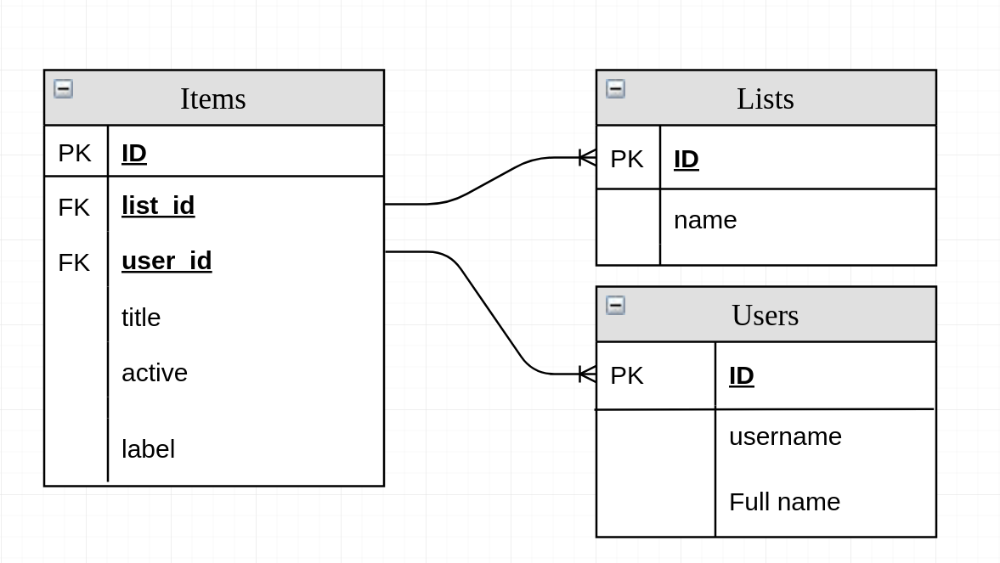

# **Baraka**

## **What our app provide ?**
  Our website enable users such as teams to add their tasks and keep touch with each others, by adding, updating, deleting and make their tasks complete.

## **Why did we built our app ?**
  Database is built to have many lists, each list will have many items that is added by user, using handlebars and postgres to display and control this data.

## **Schema digram :**
 

## **How our progress was during the building of our app ??**
 
 - Have node server and a database using express
 - Project Structure.
 - Setup Travis in our project.
 - Host database on Heroku.
 - Make tests for server routes and database.
 - Create Express server.
 - Create SQL schema.
 - Connect and build the database.
 - Code the queries for the database.
 - Handle files by handlebars.
 - Handle error from client and server.
 - Render data in hbs file then send file
 - Code Refactor.
 - Make style.
 - Fix accessibility and responsive.
 - Display data to the user.

## **User Journey :**
 - The user add the list.
 - The user can add the item with details (title, content and user name) in specific list
 - The user can view all lists with its items and tasks.